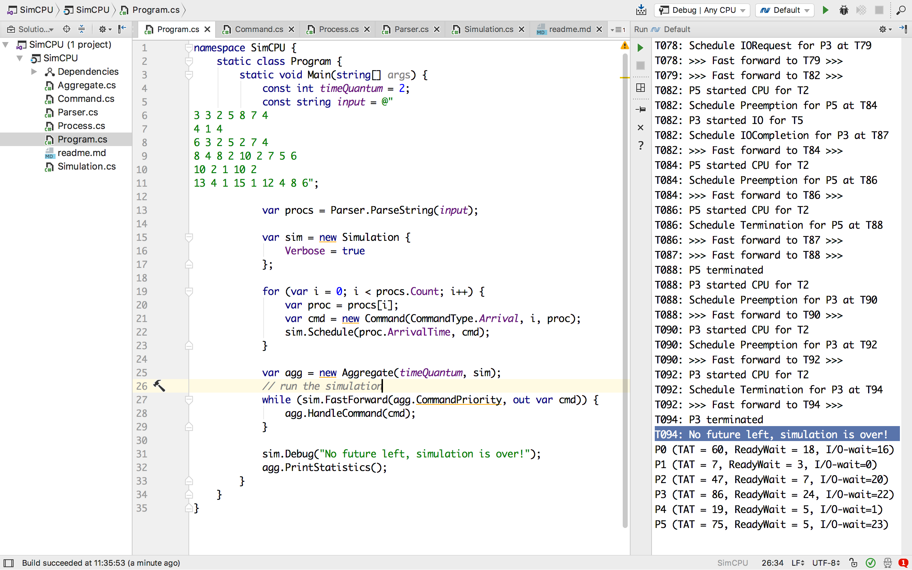

# SimCPU

This is a reference project for simulating event-driven systems and
understanding the passing of time. It is a part of the materials for two R&D
projects:

1. Deterministic simulation of event-driven systems (see [context](https://abdullin.com/sku-vault/2017-07-15-high-availability-and-performance/)).
2. Event-driven view engine (or "event-driven mainframe").




## Domain

Domain is based on the task assignment:
[CS452 Project Job Scheduling Simulation](http://www.cis.gvsu.edu/~dulimarh/CS452/Projects/JS/).

The task is to create a Round-Robin job scheduler for the system with
one CPU and one IO-device. This isn't going to be a real job
scheduler, but rather a simulation.

- processes are scheduled to arrive at a specific time based on the
  spec;
- each process has a sequence of CPU and IO tasks with varying
  duration;
- process always ends with a CPU task;
- the system has only one CPU and one IO device, for which the
  processes compete;
- if a process needs more CPU time than `TimeQuantum`, then the
scheduler can interrupt its execution and put back into the queue,
allowing the other processes to move forward;
- if multiple commands are to happen at the same point in time, then
  the order is: (1) handle new process; (2) handle process coming back
  from IO queue and (3) handle preempted (interrupted) process.

## Implementation

In this implementation we explicitly model (spell out) following
concepts:
- future and the passing of time (see [Simulation.cs](Simulation.cs))
- future requests as commands (see [Commands.cs](Command.cs))
- job scheduling algorithm running in a simulation (see
  [Aggregate.cs](Aggregate.cs))


A mixed workload with the `TimeQuantum` of 2 will be executed when you
compile and run the project:

```
3 3 2 5 8 7 4
4 1 4
6 3 2 5 2 7 4
8 4 8 2 10 2 7 5 6
10 2 1 10 2
13 4 1 15 1 12 4 8 6
```

Each line defines a single process. For instance, first line is:
- `3` - process arrival time (always ascending);
- `3` - number of CPU bursts;
-  `2 5 8 7 4` - CPU for 2 time units, IO for 5... CPU for 4 time units.

## Pay attention

**Time is an illusion**, modeled by running the simulation towards the
discrete commands we have planned in the future.

Future is represented as a list of scheduled commands sorted by their
planned execution time.

Multiple commands could be scheduled at a single point in time. Domain
logic (`Aggregate.CommandPriority` in this case) determines the order
of command execution.

While handling a command, the domain logic could schedule another
command to happen in the future.

The simulation ends when it has no future left.

## Questions

- What is a fuzz testing? How could it be applied to this project?
- How would you reproduce and debug issues discovered by the fuzz testing?

## See also

* [Naive simulation of a ring of actors](https://gist.github.com/abdullin/af7c9b7fd4aa58cadcc346c8e194d9ab)
* [An example of event-driven system potentially fit for such simulation](https://abdullin.com/sku-vault/2017-07-15-high-availability-and-performance/)

## Bonus Points

The implementation almost works. For some reason, while running the
mixed job workload with `TimeQuantum=2`:


the expected result (according to the CS452) is:
```
P0 (TAT = 60, ReadyWait = 18, I/O-wait=16)
P1 (TAT = 7, ReadyWait = 3, I/O-wait=0)
P2 (TAT = 47, ReadyWait = 7, I/O-wait=20)
P3 (TAT = 86, ReadyWait = 24, I/O-wait=22)
P4 (TAT = 19, ReadyWait = 5, I/O-wait=1)
P5 (TAT = 75, ReadyWait = 7, I/O-wait=21)
```

while the simulation returns:

```
P0 (TAT = 60, ReadyWait = 18, I/O-wait=16)
P1 (TAT = 7, ReadyWait = 3, I/O-wait=0)
P2 (TAT = 47, ReadyWait = 7, I/O-wait=20)
P3 (TAT = 86, ReadyWait = 24, I/O-wait=22)
P4 (TAT = 19, ReadyWait = 5, I/O-wait=1)
P5 (TAT = 75, ReadyWait = 5, I/O-wait=23)
```

Note the different `ReadyWait` and `I/O-wait` values for `P5`.
